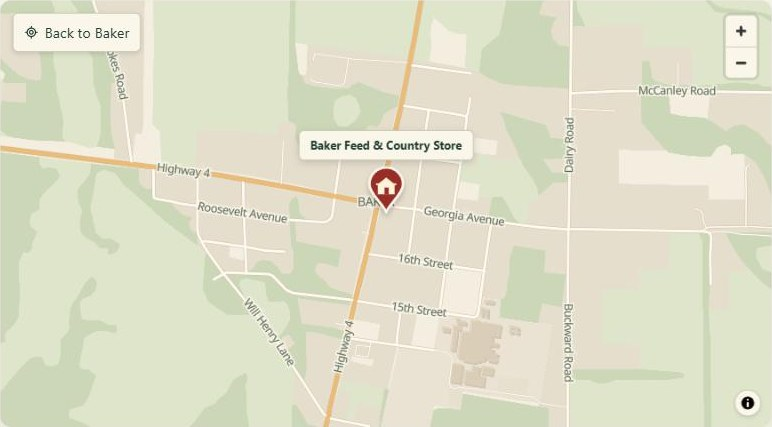

# Simple Open Maps

A drop-in map for any website. It uses free OpenStreetMap data, so you don't need Google, an API key, a billing account, or a build step. You can recolor every part of it.



- **One folder, one `<div>`, one `<script>`.** You don't write any JavaScript unless you want to.
- **Custom colors.** Choose from 4 built-in themes, or set any of the 22 colors yourself.
- **Good manners.** The map loads only when it scrolls near the screen. It shows a plain address and an "Open in OpenStreetMap" link if it can't load, and it doesn't hijack page scrolling.
- **Built on open tools:** [MapLibre GL JS](https://maplibre.org/) for drawing, [VersaTiles](https://versatiles.org/) for the map tiles, and [OpenStreetMap](https://www.openstreetmap.org/) for the data.

---

## 1. Install

Copy the **`simple-open-maps/`** folder into your website, for example to `/simple-open-maps/`.

That's all there is to it. The folder holds everything the map needs: the script, its CSS, the map style, the icons, and MapLibre.

```
your-site/
├── index.html
└── simple-open-maps/        ← copy this whole folder
    ├── simple-open-maps.js
    ├── simple-open-maps.css
    ├── style.json
    ├── sprites/
    └── maplibre/
```

## 2. Add a map

Paste these two parts into your page wherever you want the map to appear:

```html
<div
  data-simple-open-map
  data-lat="30.79694"
  data-lng="-86.68139"
  data-zoom="14.7"
  data-label="Baker Feed &amp; Country Store"
  data-home-label="Back to Baker"
  style="height: 480px">
  5791 Highway 4, Baker, Florida
</div>

<script type="module" src="/simple-open-maps/simple-open-maps.js"></script>
```

- Change `data-lat` and `data-lng` to your location (see [Finding your coordinates](#finding-your-coordinates)).
- Visitors who have JavaScript turned off see the text inside the `<div>`. Put your address there.
- Include the `<script>` line **once per page**, even when the page has several maps.
- Give the map a height. If you don't, it uses a minimum of 420px (320px on phones).

## 3. Preview it

Browsers won't load this kind of script from a file you double-click (a `file://` address). Run a small local web server from the folder that contains your page:

```bash
npx serve .
```

```bash
python -m http.server 8000
```

Then open the address it prints. On a real web host it works as is.

**Theme builder:** open `index.html` from this repo through a local server. You can pick a place and colors there, and it writes the code to paste for you.

---

## Custom colors

### Option A: pick a theme

```html
<div data-simple-open-map data-theme="midnight" ...></div>
```

| Theme | Look |
|---|---|
| `country` (default) | Warm cream land, sage parks, golden highways, a barn-red pin |
| `coastal` | Light and airy, blue water, a teal pin |
| `mono` | Quiet grays that suit almost any brand |
| `midnight` | A dark map with an amber pin |

### Option B: change individual colors

Add `data-colors` with only the colors you want to change. Everything else comes from the theme.

```html
<div
  data-simple-open-map
  data-lat="30.79694" data-lng="-86.68139"
  data-theme="coastal"
  data-colors='{"pin": "#c2410c", "highway": "#f0a95b", "water": "#7fb8d6"}'
  style="height: 480px">
</div>
```

> Wrap `data-colors` in **single quotes**, because the JSON inside uses double quotes.

Every color you can set:

| Key | What it colors |
|---|---|
| `background` | Open land (the base color of the map) |
| `developed` | Towns, commercial, industrial, schools, parking |
| `green` | Parks, fields, farmland, grass |
| `forest` | Woods and forest |
| `bare` | Sand, rock, glaciers |
| `water` | Lakes, ocean, wide rivers |
| `waterway` | Streams, canals, and narrow rivers (lines) |
| `building` | Building fill |
| `buildingOutline` | Building edges |
| `road` | Regular streets and paths |
| `roadCasing` | The thin edge line along roads |
| `highway` | Highways and main roads |
| `rail` | Railways |
| `boundary` | State and country borders |
| `label` | Street names, place names, all map text |
| `labelHalo` | The glow behind map text that keeps it readable |
| `icon` | Small point-of-interest icons and shields |
| `pin` | Your location pin |
| `pinIcon` | The house or dot inside the pin |
| `surface` | Background of the buttons, pin label, and attribution |
| `text` | Text and icons on those buttons |
| `border` | Edges of those buttons |

Colors can be any CSS color: `#c2410c`, `rgb(194 65 12)`, `hsl(20 88% 40%)`, or `tomato`.

For a dark map, set `surface` to a dark color. The zoom buttons flip their icons automatically.

**Tips for a good-looking map**

- Keep `background`, `developed`, `green`, and `forest` close in brightness. They cover most of the map.
- Make `label` contrast strongly with `background`. Set `labelHalo` to roughly your background color.
- Give `pin` and `highway` the most saturated colors. They're what people look for first.

### Changing fonts, corners, and shadows (CSS)

The buttons and pin label use CSS custom properties, so you can override them in your own stylesheet:

```css
.som {
  --som-font: "DM Sans", sans-serif; /* defaults to your page's font */
  --som-radius: 12px;                 /* button and label corners */
  --som-shadow: none;
}
```

The text on the map itself (street names) uses Noto Sans from the tile server.

---

## All options

### HTML attributes

| Attribute | Example | Meaning |
|---|---|---|
| `data-simple-open-map` | (no value) | Required. Marks the element as a map. |
| `data-lat`, `data-lng` | `30.79694`, `-86.68139` | Location. Required unless you use `data-markers`. |
| `data-zoom` | `14.7` | 3 = country, 10 = city, 15 = streets, 18 = buildings. Default `14`. |
| `data-label` | `Baker Feed &amp; Country Store` | Text above the pin. |
| `data-home-label` | `Back to Baker` | Button that returns to the starting view. `false` hides it. |
| `data-address` | `5791 Hwy 4, Baker, FL` | Shown while loading or if the map fails. |
| `data-link` | `https://…` | Where clicking the pin goes. Defaults to OpenStreetMap. |
| `data-theme` | `coastal` | `country`, `coastal`, `mono`, or `midnight`. |
| `data-colors` | `'{"pin":"#c2410c"}'` | Color overrides (JSON). |
| `data-markers` | `'[{"lat":30.4,"lng":-87.2,"label":"Pensacola"}]'` | Several pins (JSON). The map fits them all on screen. |
| `data-pin` | `dot` | Pin icon: `house` (default), `dot`, or `none`. |
| `data-scroll-zoom` | `true` | `cooperative` (default, Ctrl/⌘ + scroll to zoom), `true`, or `false`. |
| `data-lazy` | `false` | Load immediately instead of when the map is near the screen. |
| `data-zoom-buttons` | `false` | Hide the + / − buttons. |
| `data-show-labels` | `false` | Hide the text above pins. |
| `data-attribution` | `Map by <a href="…">You</a>` | Extra credit line in the (i) attribution. |
| `aria-label` | `Map of our store` | Name for screen readers. Default: "Map showing {label}". |

### JavaScript

For more control, import the module yourself:

```html
<div id="locations" style="height: 520px"></div>

<script type="module">
  import { createMap } from '/simple-open-maps/simple-open-maps.js';

  const locations = createMap('#locations', {
    theme: 'coastal',
    colors: { pin: '#c2410c' },
    homeLabel: 'Show all locations',
    markers: [
      { lat: 30.4213, lng: -87.2169, label: 'Pensacola' },
      { lat: 30.3960, lng: -86.4958, label: 'Destin', pin: 'dot' },
      { lat: 30.7835, lng: -86.5547, label: 'Crestview', color: '#0f766e' },
    ],
  });

  // Later: recolor without reloading.
  locations.setColors('midnight');
  locations.setColors({ highway: '#ff9900' });

  // Use the full MapLibre map once it's drawn.
  const map = await locations.ready;   // null if it couldn't load
  map?.flyTo({ center: [-86.5547, 30.7835], zoom: 13 });
</script>
```

`createMap(target, options)` accepts the same settings as the attributes, written in camelCase (`homeLabel`, `scrollZoom`, `zoomButtons`, `showLabels`), plus:

| Option | Meaning |
|---|---|
| `center` | `[lng, lat]` array **or** `{ lat, lng }` object. |
| `markers` | Array of `{ lat, lng, label?, link?, color?, pin?, showLabel? }`. Use `link: false` for a pin that isn't a link. |
| `marker: false` | Show no pin at all. |
| `minZoom`, `maxZoom` | Zoom limits. Defaults are `2` and `18`. |
| `padding` | Space around pins when fitting several. A number, or `{top, bottom, left, right}`. |
| `timeout` | Milliseconds to wait for tiles before showing the fallback. Default `20000`. |
| `loadingText`, `unavailableText` | Fallback messages. |
| `onReady(map, maplibregl)` | Called once the map is drawn. |
| `mapOptions` | Passed straight to [MapLibre's `Map`](https://maplibre.org/maplibre-gl-js/docs/API/type-aliases/MapOptions/). |

The returned controller has:

| Member | Meaning |
|---|---|
| `ready` | A promise. Resolves with the MapLibre map, or `null` if the map couldn't load. |
| `map`, `maplibregl` | The MapLibre map and library (`null` until loaded). |
| `setColors(themeOrColors)` | Recolor live, using a theme name or a colors object. |
| `recenter()` | Go back to the starting view. |
| `load()` | Load now, even if the map is off screen. |
| `destroy()` | Remove the map. |

**Events:** the map element fires `som:ready` (`event.detail.map`) and `som:error`. If tiles were slow but arrive later, `som:ready` still fires, even after `som:error`.

Other exports: `themes`, `colorRoles`, `getMap(element)`, `autoInit(root)`, `resolveColors(theme, colors)`, `toLngLat(value)`, and `openStreetMapUrl([lng, lat])`. The same functions are available as `window.SimpleOpenMaps` for plain scripts.

---

## Finding your coordinates

1. Go to [openstreetmap.org](https://www.openstreetmap.org/) and find your place.
2. Right-click the exact spot and choose **Show address**. The left panel shows `latitude, longitude`.
3. In the US, latitude is positive (about 25 to 49) and longitude is negative (about −67 to −125).

You can also right-click any spot in Google Maps. The first line of the menu is `latitude, longitude`.

> ⚠️ When you write a location as an array, the order is `[longitude, latitude]` (x, y). `{ lat, lng }` objects and `data-lat`/`data-lng` attributes avoid that mix-up.

## Directions links

Visitors usually want directions on their phone. You can link to any maps app. None of them need a key:

```html
<!-- OpenStreetMap -->
<a href="https://www.openstreetmap.org/directions?to=30.79694%2C-86.68139">Get directions</a>
<!-- Apple Maps (opens the Maps app on iPhone and Mac) -->
<a href="https://maps.apple.com/?daddr=30.79694,-86.68139">Get directions</a>
<!-- Google Maps (a plain link; no API needed) -->
<a href="https://www.google.com/maps/dir/?api=1&destination=30.79694,-86.68139">Get directions</a>
```

## Using it in frameworks

- **WordPress, Squarespace, Wix, Webflow:** upload the `simple-open-maps` folder (by FTP or file manager on WordPress, or as hosted files elsewhere). Then paste the two-part snippet into a **Custom HTML** or **Embed** block and use the full URL in `src`.
- **React, Vue, Svelte:** put the folder in `public/`. Call `createMap(ref)` after the component mounts and `controller.destroy()` when it unmounts. Load it with `import(/* @vite-ignore */ '/simple-open-maps/simple-open-maps.js')` so your bundler doesn't try to bundle it.
- **Static sites (Hugo, Jekyll, Eleventy, Astro):** put the folder in `static/` or `public/` and paste the snippet into a template.

## Hosting notes and fair use

- **Tiles** come from the free public VersaTiles server at `tiles.versatiles.org`. It needs no key or sign-up. It's a community service, so for a high-traffic site, read their [usage guide](https://docs.versatiles.org/guides/use_tiles_versatiles_org) or [host your own tiles](https://docs.versatiles.org/). To switch tile servers, edit the `sources` and `glyphs` URLs in `style.json`.
- **Attribution:** OpenStreetMap's license requires visible credit. The small (i) button on the map provides it. Don't hide it.
- **Size:** MapLibre is about 1 MB uncompressed, or roughly 300 KB with gzip, which most hosts apply automatically. It downloads only when a map nears the screen, so pages without a map pay nothing.
- **Browsers:** the map needs WebGL, which every modern browser has. Older browsers see the fallback address and link.
- **Content Security Policy:** if your site sends a CSP header, allow `worker-src 'self' blob:`, `connect-src https://tiles.versatiles.org`, and `img-src data: blob:`.

## Troubleshooting

| Problem | Fix |
|---|---|
| The map area is blank or 0px tall | Give the element a height (`style="height: 480px"`). |
| "Loading map…" never finishes on your computer | Use a local server (see step 3), not a double-clicked file. |
| Error in the console: *Failed to load module script* | The `src` path is wrong. Open that URL in your browser to check it. |
| The pin is in the ocean or the wrong hemisphere | Latitude and longitude are swapped. Arrays are `[lng, lat]`. |
| Nothing happens on a page that adds the div later (single-page apps) | Call `SimpleOpenMaps.autoInit()` or `createMap(el, …)` after adding it. |

## License

The Simple Open Maps code is under the [MIT License](LICENSE). The bundled MapLibre GL JS is BSD-3-Clause (`simple-open-maps/maplibre/LICENSE.txt`). The map style is adapted from the VersaTiles CC0 style. Map data © OpenStreetMap contributors (ODbL). See [THIRD-PARTY-NOTICES.md](THIRD-PARTY-NOTICES.md).
